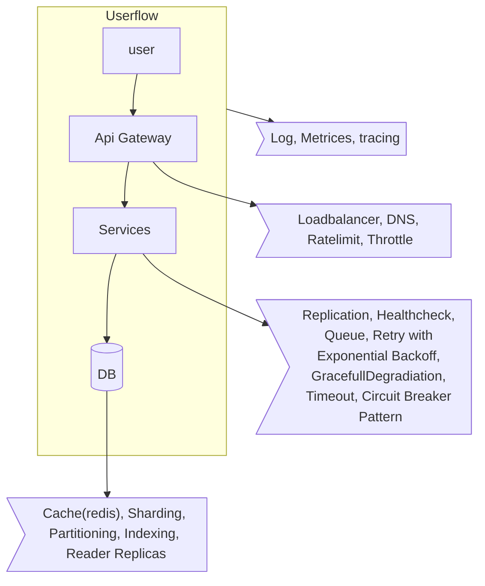

```mermaid
flowchart TB
    subgraph Userflow
        direction TB
        A[user]-->B[Api Gateway]-->C[Services]-->D[(DB)]
    end
    B-->E>"Loadbalancer, DNS, Ratelimit, Throttle"]
    C-->G>"Replication, Healthcheck, Queue, Retry with Exponential Backoff, GracefullDegradiation, Timeout, Circuit Breaker Pattern"]
    D-->H>"Cache(redis), Sharding, Partitioning, Indexing, Reader Replicas"]

    Userflow-->I>"Log, Metrices, tracing"]
```